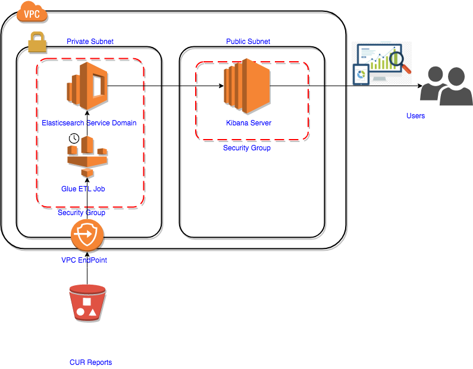
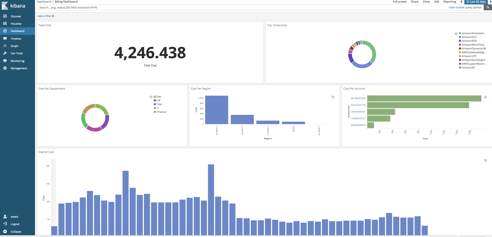

# AWS Billing Dashboard

## Visualize AWS Cost and Usage data using Glue, Amazon Elasticsearch, and Kibana

AWS launched [Cost and Usage Reports (CUR)](https://docs.aws.amazon.com/awsaccountbilling/latest/aboutv2/billing-reports-costusage.html) in late 2015 which provides comprehensive data about your costs, and Amazon provides Cost Explorer to view your costs for up to the last 13 months. But what if you want to analyze your billing data in the past a few years? What if you want a customize way to show your data for your business needs?

In this post, I'll show you how to import Cost and Usage Report data into Amazon Elasticsearch service, and create your own Kibana billing dashboard.

## Solution Overview

Many customers have legitimate privacy and security concerns about sending and receiving data across the Internet. We address these concerns by putting the Glue job and Elasticsearch Service (ES) domain inside of your VPC and using VPC endpoints to securely access billing data from an S3 bucket.

In this solution, we use a scheduled Glue ETL job. The Glue job will transform the newly uploaded data and upload it to Elasticsearch to build the index so the end users can see the latest charts right away from Kibana Dashboard.

Here is an overview of how the solution works:



## Why Glue and Elasticsearch Service

Let's take a step back and see how the cost and usage report works and how we ended up choosing Elasticsearch Service and Glue.

AWS delivers the cost and usage report files to an Amazon S3 bucket that you specify in your account, and updates the report up to three times a day in .csv format. Each upload will generate a unique folder name called assembly ID, and the csv file(s) are GZipped. The size of an individual report can grow to more than two gigabytes, and if a report is larger than most applications can handle, AWS splits the report into multiple files that are stored in the same folder.

Here is an example of the folder structure for the report:

```
<report-prefix>/<report-name>/20180101-20180201/<dd7544e6-b151-4cb6-805d-6400f07c614a>/<report-name>-<1>.csv.gz
<report-prefix>/<report-name>/20180101-20180201/<dd7544e6-b151-4cb6-805d-6400f07c614a>/<report-name>-<2>.csv.gz
<report-prefix>/<report-name>/20180101-20180201/<dd7544e6-b151-4cb6-805d-6400f07c614a>/<report-name>-<3>.csv.gz
<report-prefix>/<report-name>/20180101-20180201/<dd7544e6-b151-4cb6-805d-6400f07c614a>/<report-name>-Manifest.json
```

The first challenge we face is that the consolidated billing is enabled for several accounts, which results in large amount of billing data, and AWS splits the data into 16+ csv.gz files. Here is the data we are dealing with for a single upload of the CUR reports:

* Total data size: 25 GB
* Total billing records: 30 million
* Average size of .csv.gz: 120 MB (about 1.5GB after unzipping)

The second challenge is the schema of the csv file may change from time to time, because:

* Add/Remove Customized [Cost Allocation Tags](https://docs.aws.amazon.com/awsaccountbilling/latest/aboutv2/cost-alloc-tags.html)
* .csv columns are changed by Amazon

At first, I tried Athena and QuickSight, because the in-place S3 query and tight integration between these two services are really intriguing. But soon I found that Athena cannot handle the schema change which will pop up the partition schema mismatch issue when I tried to load data from multiple months using Glue data catalog as meta store. That's why I chose AWS ElasticSearch and Kibana for the solution. The dynamic indexing feature of ElasticSearch makes it easy to index data in different schemas and make it available for users to explore. The performance is also good for the quantity of data we have. Fortunately, AWS has a fully managed Elasticsearch Service. Glue is a natural choice for ETL since it's a serverless, managed solution.

Now let's take a closer look at this solution and how to deploy it.

## Prerequisites

Here are the prerequisites for this solution:

1. The Cost and Usage Report must be enabled, if you haven't done this, please follow the instructions [here](https://docs.aws.amazon.com/awsaccountbilling/latest/aboutv2/billing-reports-gettingstarted-turnonreports.html)
2. Prepare an IAM role for the Glue job which has these IAM permissions:

* Read access to S3 bucket that contains the CUR reports
* Full access to Amazon Elasticsearch Domain, consider the `AmazonESFullAccess` managed policy.
* AWSGlueServiceRole

## Setup and Deploy the solution

1. Identify a VPC you want to use to deploy the solution.
2. Choose or create a private subnet in the VPC
3. Create a security group in the VPC.
4. Create VPC Endpoint for S3 and associate with the subnet above - [AWS Blog](https://aws.amazon.com/blogs/aws/new-vpc-endpoint-for-amazon-s3/) shows a detailed instruction about how to create it through the console.
5. Set up a ES domain in the VPC and private subnet above, [here](https://docs.aws.amazon.com/elasticsearch-service/latest/developerguide/es-createupdatedomains.html) is the for the detailed steps
6. Create a JDBC connection following [guidelines](https://docs.aws.amazon.com/glue/latest/dg/console-connections.html). Choose the VPC, subnet and security group created above.
7. Create a Python library package in your local console and upload it to a S3 bucket. NOTE: please use python 2.x for this solution

    ```bash
    mkdir esglueaccess
    cd esglueaccess
    pip install elasticsearch -t .
    zip -r ../es.zip ./*
    ```

8. Follow the [Glue add job instructions](https://docs.aws.amazon.com/glue/latest/dg/add-job.html) to create a Glue job with these inputs:
    * Name: cur-s3-to-es-domain
    * IAM role: the role you created in prerequisites section
    * This job runs: A new script to be authored by you
    * ETL language: Python
    * Python lib path: S3 bucket you created in Step 6, e.g. s3://glue-python-package-for-es/es.zip
    * Job parameters: you need to provide 5 parameters, the values here are for your reference
    ```bash
        # source bucket name
        # e.g. cur-billing-bucket
        --source_bucket
        # the prefix of the actual report folders, the report folders are like this 20171231-20180101
        # e.g. CostAndUsageReport
        --report_folder_prefix
        # the elasticsearch index name template {} will be replaced by year and month
        # e.g. cur{}{}
        --index_name_prefix_template
        # the elasticsearch index pattern used to generate the dashboard
        # NOTE: it needs to be different from index name template
        # e.g. yourorgname-billing-report
        --index_pattern_prefix
        # your elasticsearch service domain URL
        --es_domain_url
    ```
    * Connections: Choose the jdbc connection created in step 6.
    * For other inputs, use default settings
9. Get the glue job script from [1Strategy Cost and Usage Reports Github repo](https://github.com/1Strategy/visualize-cur-using-glue-es) and put it into the script console, click [Save]

10. Create a daily scheduled Glue job trigger following the guideline [here](https://docs.aws.amazon.com/glue/latest/dg/console-triggers.html). Make sure to set all job parameters properly esp. the `--es_domain_url`.

Note:

* To put Glue job in same VPC with ES domain you'll need to create a JDBC connection in Glue data catalog and make sure to choose the right VPC.
* It's not very common to use Glue jobs to access ES in same VPC, Glue was designed to access JDBC data source. Just put in a mock JDBC url like this jdbc:mysql://test:9243/test.

## Glue job and index speed tuning

You'll need to tune the performance a bit to find the best parallel bulk sessions (partitions) against the Elasticsearch Service cluster spec you choose. You can refer to the guildelines on [how to tune indexing performance](https://www.elastic.co/guide/en/elasticsearch/reference/current/tune-for-indexing-speed.html).

Here are the items we tested that helps improved index performance for our solution:

* Disable refresh and replicas for initial data loads
* Use auto-generated ids
* Use bulk requests
* User 3 worker nodes (m4.xlarge) to send data to Elasticsearch Domain

## Kibana dashboard and metrics

Now the cost and usage report data is scheduled to be copied to Elasticserch service domain everyday, time to visualize these data using Kibana.

There is a tradeoff to use VPC to secure and simplify communication between Glue and Elasticsearch service domain - the subnet has to be private. It is by design for Glue job when using JDBC connections for security purposes. So we can't use the default Kibana that comes with the Elasticsearch domain. We need to start a Kibana server on a EC2 instance in the same VPC but a public subnet, and use security group to manage the access to the kibana server.

Here are some sample metrics we created:


## Conclusion

AWS cost and usage reports have all the data we need to understand our billing, we can use these data to create customized dashboard based on our business needs, in order to monitor, control and optimize our cost. Athena and Quicksight is a great and quick solution when you want to analyze billing data for single month, and with Glue and Elasticsearch Service, we are able to create a fully customized billing dashboard with large amount of data.

## License
Licensed under the Apache License, Version 2.0.